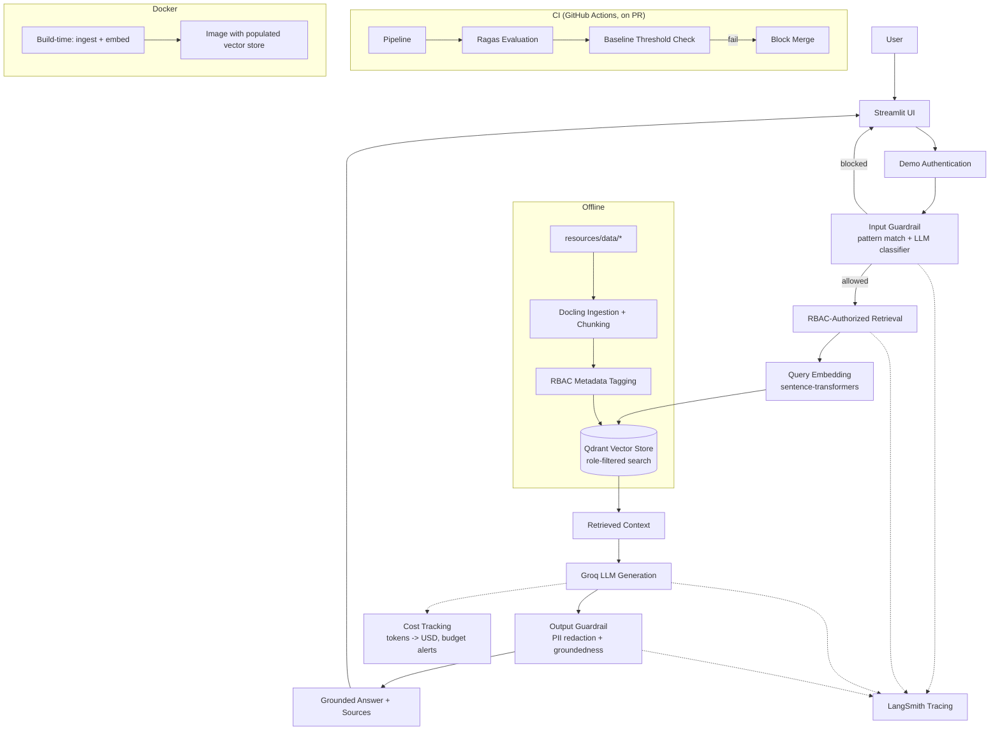

# FinSolve Internal Assistant

[](https://www.python.org/downloads/release/python-3100/)
[](https://streamlit.io/)
[](https://www.docker.com/)
[](https://github.com/palakbhati/secure-rag-rbac-chatbot/actions/workflows/ci.yml)

A secure internal knowledge assistant for FinSolve Technologies that answers employee questions from private company documents — with retrieval-augmented generation, role-based access control enforced at the retrieval layer (not just the prompt), layered prompt-injection defenses, source-grounded answers, LLM-based evaluation, and per-request cost tracking.

---

## Overview

Internal company documents span multiple sensitivity levels — an engineering wiki, quarterly financials, HR records with real PII, marketing reports — and different employees are authorized to see different subsets of that information. Pointing a generic LLM chat interface at all of it and trusting a system prompt to "only share what's appropriate" is not a security boundary; prompt instructions can be ignored, worked around, or simply fail silently.

This project treats that as the actual problem to solve. Documents are tagged with department and role metadata at ingestion time, and every retrieval query is filtered by the requesting user's role **inside the vector database itself** — an unauthorized document is never fetched, so it's never available for the model to leak, regardless of how the question is phrased. On top of that sits a second layer: input guardrails that catch prompt-injection attempts before they reach the LLM, and output guardrails that redact PII and flag ungrounded answers before they reach the user.

The result is an internal assistant that engineering, finance, marketing, HR, and executive staff can all use against the same document set, each seeing only what their role is authorized to see, with source citations on every answer.

---

## Key Features

### 🔐 Authentication
A demo authentication layer (`app/services/auth/demo_users.py`) maps a hardcoded username/password to a role. This is explicitly a **development/demo mechanism** — plaintext credentials in a Python dict are acceptable only because every account here is one the project owner controls. A production deployment would replace this with a real identity provider (Azure AD / Entra ID via OAuth2/OIDC), where the app never sees a password and the role comes from actual directory group membership.

### 👥 Role-Based Access Control
Five roles are supported: `engineering`, `finance`, `marketing`, `hr`, and `executive`. Documents are tagged by department at ingestion time with an explicit `allowed_roles` list (`app/services/ingestion/access_control_map.py`), and every retrieval call is filtered by role as a **native Qdrant payload filter** — not a post-hoc check on already-fetched results. `general`-classified content (e.g. the employee handbook) is visible to every role; department-specific content (finance reports, HR records) is restricted to that department plus `executive`. An 11-test suite (`tests/test_rbac.py`) codifies the exact allow/deny matrix.

### 📚 Retrieval-Augmented Generation
Source documents (markdown + one CSV) are parsed with **Docling**, split with a header-aware + character-based chunking strategy, embedded with a local **sentence-transformers** model, and stored in **Qdrant**. At query time, the question is embedded, filtered by role, and the top-k matching chunks are assembled into context for the LLM — answers are grounded in retrieved company documents, not the model's general knowledge.

### 🛡 Prompt Injection Protection
A two-layer input guardrail runs before any retrieval or LLM cost is spent: a fast deterministic pattern match catches obvious injection phrasing for free, and an LLM-based classifier catches subtler attempts and off-topic questions. If the classifier layer is unavailable, the guardrail fails open (question proceeds on layer-1 result alone) rather than taking the whole assistant offline over a secondary safety layer — RBAC and the output guardrail remain active regardless. A separate output guardrail redacts PII that can't be traced back to retrieved context (catching hallucination) and applies role-aware redaction of sensitive HR fields.

### 🔎 Source Citations
Every answer is returned alongside the specific document chunks that were retrieved to produce it, surfaced in the UI as an expandable "Sources" panel — never buried in the chat text.

### 📊 RAG Evaluation
Evaluated with **Ragas** across four metrics against a 10-question golden dataset (`evaluation/dataset.py`), with reference answers checked directly against the source documents rather than guessed:

| Metric | Purpose |
|---|---|
| Faithfulness | Does the answer's claims trace back to retrieved context? Catches hallucination. |
| Answer Relevancy | Does the answer actually address the question asked? |
| Context Precision | Of the retrieved chunks, how many were actually relevant? |
| Context Recall | Did retrieval get everything needed for a complete answer? |

### 💰 Cost Tracking
Every LLM call's token usage is recorded with its calculated USD cost (`app/services/cost_tracking/`), based on a pricing table kept fully separate from calculation logic so a price change or model swap never touches code. Daily and monthly spend are tracked independently, each checked against a configurable budget with warning (80%) and critical (100%) alert thresholds — this is a monitoring signal, not an enforcement block; hitting budget logs an alert rather than refusing to answer employees.

### 🐳 Docker
Ingestion and vector-store population run **at image build time**, not container startup — since the source documents are static, this means every container start is instant with no runtime dependency on model downloads. Neither build step calls Groq, so no secrets are ever baked into the image; the LLM API key is supplied only at runtime.

### ⚙️ CI/CD
GitHub Actions runs two jobs: a fast unit-test job (RBAC permission matrix, no LLM calls) on every push, and a slower RAG evaluation job — gated to pull requests only, and only after unit tests pass — that re-ingests documents, rebuilds the vector store, runs the full Ragas evaluation, and fails the build if any metric drops below its calibrated baseline threshold. This is **continuous evaluation gating merges**, not continuous deployment — there is no automated deployment step in this repository.

---

## Architecture



---

## RAG Pipeline

1. **Authentication** — user logs in via the demo credential store, receiving a role.
2. **User submits a question** through the Streamlit chat interface.
3. **Input guardrail** — pattern match, then (if needed) LLM classification for injection/out-of-scope detection. A blocked question stops here.
4. **RBAC-authorized retrieval** — the question is embedded and searched against Qdrant with a native filter on the user's role; unauthorized documents are never fetched.
5. **Context assembly** — retrieved chunks are formatted into the prompt, each tagged with its source document.
6. **LLM generation** — Groq generates an answer grounded in the assembled context.
7. **Output guardrail** — redacts untraceable PII (hallucination defense) and role-inappropriate sensitive fields; attaches a caveat if the answer's groundedness against context is low.
8. **Answer + sources returned** to the UI, with citations shown separately from the answer text.
9. **Usage/cost tracking** — token counts and calculated cost are logged per request, checked against budget thresholds.
10. **Tracing** — the full call tree (guardrails, retrieval, generation) is traced to LangSmith if configured, for observability into any single request.

---

## Security Model

**Authentication** is a demo-only credential store; see the Authentication feature above for what a production replacement looks like.

**Authorization (RBAC)** is enforced as a native filter inside the vector database at retrieval time — not as an instruction to the LLM, and not as a filter applied after documents are already fetched. A role that isn't authorized for a department's content never retrieves it in the first place, regardless of how the question is phrased.

**Prompt injection protection** runs in two layers before any retrieval happens, described under Key Features above. Detection details (specific patterns, classifier prompts) are intentionally not reproduced in full here, in line with not publishing the exact shape of internal security controls.

**Output-side protection** independently redacts PII that can't be traced back to retrieved context, and applies role-aware redaction for sensitive HR data — this means even a role authorized to retrieve certain content can have specific sensitive fields (e.g. individual salary figures) withheld from the generated answer text itself.

**Separation of concerns**: the Streamlit UI never implements or duplicates any authorization, retrieval, or security logic — it only calls `authenticate()` and `ask()` and renders their results. All security-relevant logic lives in the backend (`app/rbac/`, `app/guardrails/`), independent of how the UI presents it.

No passwords, API keys, or internal detection patterns are reproduced in this document.

---

## Evaluation

The evaluation harness (`evaluation/`) runs a 10-question golden dataset through the real pipeline and scores results with Ragas, using Groq as the judge LLM.

**Baseline thresholds, calibrated from two real evaluation runs, not assumed or copied from generic defaults:**

| Metric | Run 1 | Run 2 | CI Threshold |
|---|---|---|---|
| Faithfulness | *(failed — rate limited)* | 0.695 | 0.60 |
| Answer Relevancy | 0.9255 | 0.9255 | 0.88 |
| Context Precision | 0.750 | 0.575 | 0.45 |
| Context Recall | 0.464 | 0.714 | 0.35 |

Answer relevancy scored identically across both runs and earns a tight threshold margin as a result. Context precision and context recall showed substantial run-to-run variance (spreads of 0.175 and 0.250 respectively) — expected behavior for a 10-example, LLM-judged evaluation set, not a sign of an unstable pipeline. Thresholds are set below the **lower** of the two observed runs specifically to absorb that variance.

These thresholds are a **regression floor, not a quality target** — a passing CI run means "no worse than the last real baseline," not "production-ready." Context precision and recall are known areas for improvement; as the pipeline and the eval dataset (currently intentionally small, to validate the mechanism first) grow, thresholds should be raised to lock in real improvements.

CI runs this evaluation automatically on every pull request to `main` (after unit tests pass), uploading results as a build artifact and failing the merge if any metric drops below its threshold.

---

## Cost Monitoring

Pricing is a flat lookup table (`app/services/cost_tracking/pricing.py`), verified against Groq's published rates as of August 2026 — re-check `console.groq.com/pricing` before relying on these for anything beyond estimation, since Groq's pricing is usage-based and subject to change:

| Model | Input ($/1M tokens) | Output ($/1M tokens) |
|---|---|---|
| llama-3.1-8b-instant *(default)* | $0.05 | $0.08 |
| llama-3.3-70b-versatile | $0.59 | $0.79 |
| openai/gpt-oss-20b | $0.075 | $0.30 |
| openai/gpt-oss-120b | $0.15 | $0.60 |

Every request's actual input/output token counts (from Groq's response) are used to calculate a real per-request cost, appended to a local usage log. Daily and monthly spend are aggregated independently and checked against configurable budgets (defaults: **$10/day**, **$200/month**), with a **warning at 80%** of budget and a **critical alert at 100%** — logged, not enforced; the assistant does not refuse to answer employees because a budget number was crossed.

---

## Tech Stack

| Technology | Purpose |
|---|---|
| Python 3.10 | Application language |
| Streamlit | User interface |
| LangChain / LangChain-Groq | LLM orchestration and Groq integration |
| Groq | LLM inference (`llama-3.1-8b-instant` by default) |
| Qdrant | Vector store, with native role-based payload filtering |
| Sentence-Transformers | Local embedding generation (`all-MiniLM-L6-v2`) |
| Docling | Document parsing/ingestion |
| Ragas | RAG evaluation (faithfulness, relevancy, precision, recall) |
| LangSmith | Request tracing and observability |
| Pydantic / Pydantic-Settings | Config and data validation |
| Docker | Containerization, with build-time ingestion |
| GitHub Actions | CI: unit tests + gated RAG evaluation |
| Pytest | Unit testing (RBAC permission matrix) |
| Pandas | Structured (CSV/HR) data handling |

---

## Project Structure

```text
.
├── app/
│   ├── core/               # Central settings (Settings/get_settings) — no hardcoded config
│   ├── guardrails/         # Input (injection/scope) + output (PII/groundedness) guardrails
│   ├── rbac/               # Roles, permissions, and the RBAC-authorized retrieval choke point
│   ├── schemas/            # Shared Pydantic models (DocumentChunk, etc.)
│   ├── services/
│   │   ├── auth/           # Demo credential store
│   │   ├── cost_tracking/  # Pricing table, usage tracker, budget alerts
│   │   ├── ingestion/      # Docling parsing, chunking, RBAC metadata tagging
│   │   ├── monitoring/     # LangSmith tracing configuration
│   │   ├── rag/            # Prompt construction, LLM generation, the guarded pipeline
│   │   └── vector_store/   # Qdrant client, collection management, embeddings
│   └── main.py             # Unused FastAPI stub from the original starter template — superseded entirely by streamlit_app.py
├── evaluation/              # Golden dataset, Ragas harness, baseline thresholds
├── resources/
│   └── data/               # Source documents by department (engineering, finance, general, hr, marketing)
├── tests/                   # RBAC permission-matrix unit tests
├── .github/workflows/       # CI pipeline
├── .streamlit/              # Forced light theme configuration
├── Dockerfile
├── requirements.txt
└── streamlit_app.py         # The actual application entry point
```

---

## Running Locally

```bash
git clone https://github.com/palakbhati/secure-rag-rbac-chatbot.git
cd secure-rag-rbac-chatbot
python -m venv .venv
source .venv/bin/activate
pip install -r requirements.txt

# .env needs at minimum: GROQ_API_KEY
cp .env.example .env   # then fill in your key

python -m app.services.ingestion.pipeline
python -m app.services.vector_store.build
python -m streamlit run streamlit_app.py
```

## Running with Docker

```bash
docker build -t finsolve-chatbot .
docker run -p 8501:8501 --env-file .env finsolve-chatbot
```

Open `http://localhost:8501`.

---

## Demo Accounts

| Username | Role |
|---|---|
| Tony | engineering |
| Sam | finance |
| Bruce | marketing |
| Natasha | hr |
| Nick | executive |

Demo credentials only — see the Authentication section above.

---